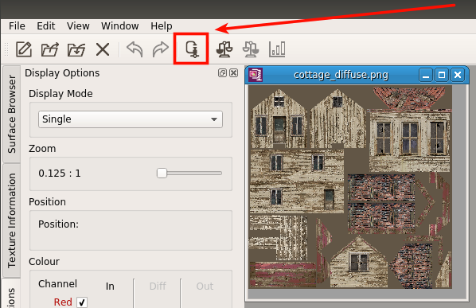

.. _repo_address: https://github.com/egslava/arena_shooter

============
Using assets
============

.. _res directory:

**Resource directory** (res directory) is the *res/* directory in the *`project directory`_/client* directory.

Images
======
The PVR file format is used. So you should `download <https://www.imgtec.com/developers/powervr-sdk-tools/installers/>`_ Power VR SDK first and choose PVRTexTool in the installer.

    
    After opening an image, use **"Encode the current texture to a new format"** menu.

    Use RGBA/8888 format and set **"Vertical Flip"** checkbox, then, press *Encode*. After that, save the new PVR image to the *"res"* directory of the project.

Models
======
To load a model you need to convert it to save it as an .OBJ file and, then, use a converter to transform it to the inner format that should be places under *res/* directory.

Exporting .obj in Blender
-------------------------
*File* -> *Export* -> *Wavefront* (.obj)*

    During an export of a model, please, set the parameters: **Y Forward**, **Z up**, *Apply modifiers*, *Write normals*, *Include UVs*, **Triangulate Faces**.

Converting .obj -> .model
-------------------------
The game loads its own 3D model file format. The converter is in the *$PROJECT_DIR/utils/models.py* module. *Currently*, to use it, you need to open the file and modify the input and output file names manually.

After using the converter, place the model file to the *res* directory.

Troubles
--------
I couldn't find the right settings, when I was trying to export .OBJ. So it is nice to have a way to check whether the output correct or not:

1. Export the model to .obj and open the file in an editor.
2. Open Blender's console and type: 

.. code:: Python

    mesh = bpy.data.meshes['Plane'];  # or 'Box' or anything
    for vert in mesh.vertices: 
        vert.co
        
3. Compare outputs of .obj and Python's code above:

.obj

.. code:: Python

    v 0.000000 0.000000 0.000000
    v 4.000000 0.000000 0.000000
    v 0.000000 2.000000 0.000000
    v 4.000000 2.000000 0.000000
    
vs raw data:

.. code:: Python

    Vector((0.0, 0.0, 0.0))
    Vector((4.0, 0.0, 0.0))
    Vector((0.0, 2.0, 0.0))
    Vector((4.0, 2.0, 0.0))

Looks correct!